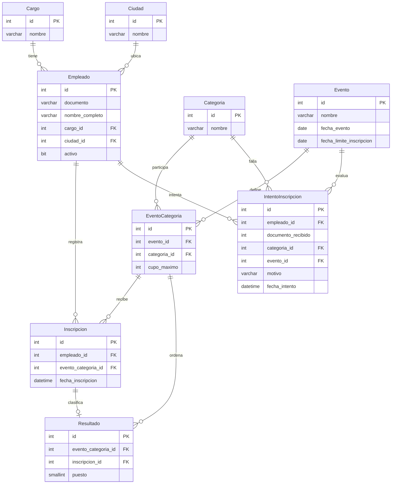

# Diagrama relacional

```mermaid
erDiagram
    Cargo ||--o{ Empleado : tiene
    Ciudad ||--o{ Empleado : ubica
    Categoria ||--o{ EventoCategoria : participa
    Evento ||--o{ EventoCategoria : define
    EventoCategoria ||--o{ Inscripcion : recibe
    Empleado ||--o{ Inscripcion : registra
    Inscripcion ||--o| Resultado : clasifica
    EventoCategoria ||--o{ Resultado : ordena
    Empleado ||--o{ IntentoInscripcion : intenta
    Categoria ||--o{ IntentoInscripcion : falla
    Evento ||--o{ IntentoInscripcion : evalua

    Cargo {
        int id PK
        varchar nombre
    }
    Ciudad {
        int id PK
        varchar nombre
    }
    Categoria {
        int id PK
        varchar nombre
    }
    Empleado {
        int id PK
        varchar documento
        varchar nombre_completo
        int cargo_id FK
        int ciudad_id FK
        bit activo
    }
    Evento {
        int id PK
        varchar nombre
        date fecha_evento
        date fecha_limite_inscripcion
    }
    EventoCategoria {
        int id PK
        int evento_id FK
        int categoria_id FK
        int cupo_maximo
    }
    Inscripcion {
        int id PK
        int empleado_id FK
        int evento_categoria_id FK
        datetime fecha_inscripcion
    }
    Resultado {
        int id PK
        int evento_categoria_id FK
        int inscripcion_id FK
        smallint puesto
    }
    IntentoInscripcion {
        int id PK
        int empleado_id FK
        int documento_recibido
        int categoria_id FK
        int evento_id FK
        varchar motivo
        datetime fecha_intento
    }
```

La estructura sigue la tercera forma normal: los catálogos están normalizados, las relaciones se resuelven mediante claves foráneas.
